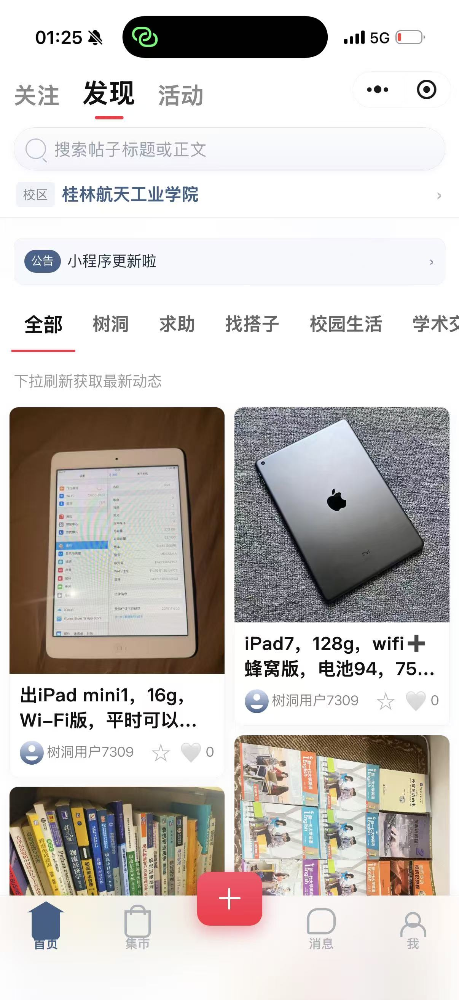
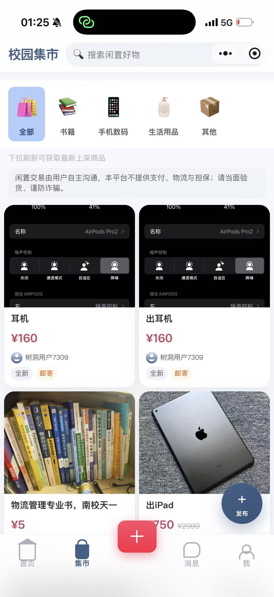
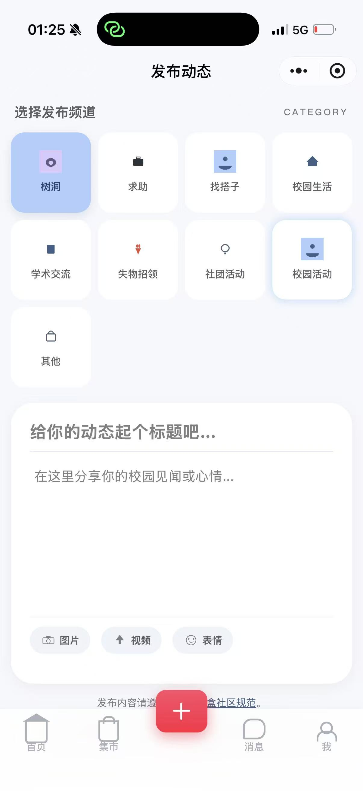
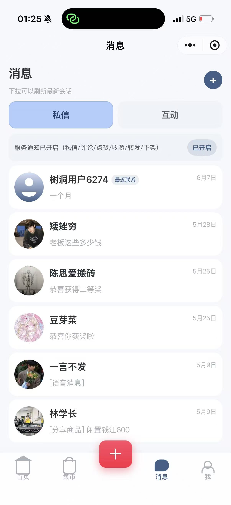
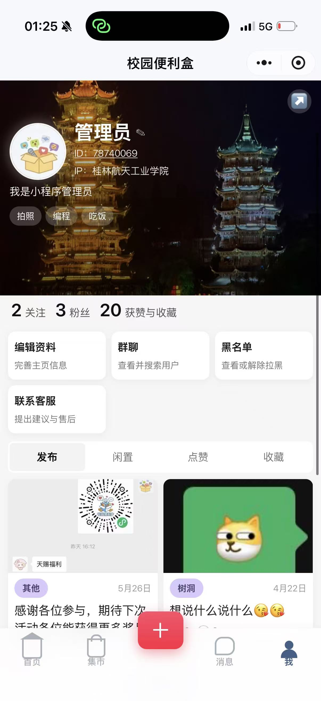
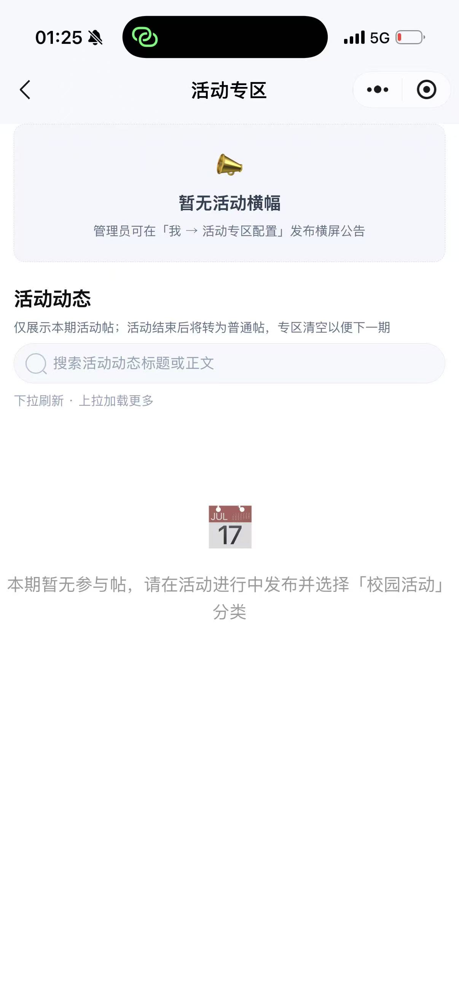

# 校园便利盒

<div align="center">

**一个面向高校生活服务、内容互动与校园运营的小程序项目**

校园动态 · 二手集市 · 互助发布 · 私信沟通 · 活动公告 · 运营后台


</div>

---

## 项目简介

**校园便利盒** 是一个围绕校园本地生活构建的微信小程序项目，目标是把学生常用的发布、交易、通知、活动、互助、私信等能力整合到一个轻量入口中。

项目采用 **微信小程序前端 + 腾讯云开发 CloudBase 云函数 + Web 管理后台** 的结构，既支持学生端使用，也支持管理员进行内容审核、公告发布、活动运营和数据管理。

## 核心能力

| 模块 | 说明 |
| --- | --- |
| 首页信息流 | 聚合校园内容、公告、推荐入口和快捷功能 |
| 校园集市 | 支持二手物品、服务信息、详情查看与发布 |
| 内容发布 | 支持帖子、互助、活动、分享类内容发布 |
| 消息与私信 | 用户间基础沟通、消息列表与会话入口 |
| 个人中心 | 个人资料、关注、拉黑、联系方式等用户能力 |
| 活动公告 | 管理员发布公告、活动专区与活动详情 |
| 推荐/邀请 | 用户推荐、员工邀请、推荐记录管理 |
| 管理后台 | Web 管理端用于内容运营、公告、活动、数据看板 |
| 云函数服务 | 登录、数据库操作、内容安全、通知推送、后台接口 |

## 界面预览

项目当前已经覆盖学生端主流程与管理端入口，下面是核心页面截图。

<table>
  <tr>
    <td align="center" width="33%">
      
      <br>
      <strong>首页发现</strong>
      <br>
      <sub>校区切换、公告入口、分类筛选与瀑布流内容展示</sub>
    </td>
    <td align="center" width="33%">
      
      <br>
      <strong>校园集市</strong>
      <br>
      <sub>二手商品分类、搜索、商品卡片与发布入口</sub>
    </td>
    <td align="center" width="33%">
      
      <br>
      <strong>发布动态</strong>
      <br>
      <sub>树洞、求助、找搭子、校园生活等多频道发布</sub>
    </td>
  </tr>
  <tr>
    <td align="center" width="33%">
      
      <br>
      <strong>消息中心</strong>
      <br>
      <sub>私信会话、互动消息与服务通知状态</sub>
    </td>
    <td align="center" width="33%">
      
      <br>
      <strong>个人主页</strong>
      <br>
      <sub>资料展示、关注粉丝、发布内容与管理快捷入口</sub>
    </td>
    <td align="center" width="33%">
      
      <br>
      <strong>活动专区</strong>
      <br>
      <sub>活动横幅、活动动态搜索与空状态提示</sub>
    </td>
  </tr>
</table>

## 技术架构

```text
用户侧微信小程序
├─ 页面层：pages/*
├─ 组件层：components/*
├─ 工具层：utils/*
└─ 静态资源：images/*

腾讯云开发 CloudBase
├─ login                 # 登录与身份识别
├─ dbOperations          # 核心数据库读写接口
├─ adminPanel            # 管理后台接口
├─ contentCheck          # 内容安全检查
├─ notifySender          # 通知推送
├─ userReferral          # 推荐/邀请逻辑
└─ bindInviteEmployee    # 邀请绑定逻辑

运营后台
└─ hosting/admin.html    # Web 管理页面
```

## 页面地图

| 类型 | 页面 |
| --- | --- |
| 主导航 | 首页、集市、发布、消息、我的 |
| 内容浏览 | 详情页、分享页、公告页、活动页 |
| 用户关系 | 资料页、关注页、黑名单、私信聊天 |
| 发布编辑 | 帖子发布、帖子编辑、集市发布、集市详情 |
| 管理能力 | 公告管理、公告编辑、活动专区管理、推荐管理 |
| 基础页面 | 登录、隐私说明、联系方式 |

## 项目目录

```text
stitch_mvp/
├─ campus_treehole/                    # 小程序主工程
│  ├─ app.js                           # 小程序入口逻辑
│  ├─ app.json                         # 页面、窗口、TabBar 配置
│  ├─ app.wxss                         # 全局样式
│  ├─ pages/                           # 小程序页面
│  ├─ components/                      # 自定义组件
│  ├─ cloudfunctions/                  # 云函数目录
│  ├─ hosting/                         # Web 管理后台
│  ├─ images/                          # 图标与静态资源
│  ├─ scripts/                         # 运维/数据库辅助脚本
│  └─ utils/                           # 通用工具函数
├─ azure_campus/                       # 设计与补充资料
├─ _1/ ~ _5/                           # 后台页面、素材与历史资料
├─ skills/                             # 项目相关技能/说明
├─ project.config.json                 # 微信开发者工具项目配置
├─ CONTRIBUTING.md                     # 贡献指南
└─ README.md                           # 项目首页说明
```

## 本地开发

### 1. 克隆仓库

```bash
git clone https://github.com/Joho6666/xyblh426.git
cd xyblh426
```

### 2. 打开小程序项目

使用 **微信开发者工具** 打开仓库根目录：

```text
xyblh426/
```

不要只打开 `campus_treehole/`，因为根目录存在微信开发者工具项目配置。

### 3. 安装辅助依赖

```bash
cd campus_treehole
npm install
```

依赖主要用于 CloudBase CLI、云函数部署和维护脚本；小程序本体不依赖 Web 打包流程。

### 4. 配置本地私有文件

本项目不会提交真实密钥。需要本地创建或维护：

```text
campus_treehole/cloudbaserc.json
project.private.config.json
```

注意：

- `cloudbaserc.json` 用于 CloudBase 环境变量与云函数配置。
- `project.private.config.json` 是微信开发者工具本地私有配置。
- 这些文件已加入忽略规则，不应提交到 GitHub。

## 常用命令

在 `campus_treehole/` 目录下执行：

```bash
# 同步云函数环境变量
npm run cloud:push-fn-env

# 部署全部云函数
npm run cloud:deploy-functions

# 部署常用修复函数
npm run cloud:deploy-bugfix

# 创建用户拉黑相关集合
npm run db:create-user-blocks-collection

# 初始化用户拉黑数据
npm run db:provision-user-blocks
```

## 云函数说明

| 云函数 | 作用 |
| --- | --- |
| `login` | 小程序用户登录、获取身份信息 |
| `dbOperations` | 统一数据库读写与业务接口 |
| `adminPanel` | 管理后台专用接口 |
| `contentCheck` | 内容安全检查 |
| `notifySender` | 订阅消息/通知推送 |
| `userReferral` | 用户推荐、邀请相关逻辑 |
| `bindInviteEmployee` | 邀请员工绑定逻辑 |
| `xiaoyuanbianlihe` | 项目相关扩展函数 |

## 安全说明

本仓库已经按公开仓库标准处理敏感信息：

- 不提交真实密钥、令牌、账号密码。
- 不提交 `cloudbaserc.json`。
- 不提交 `project.private.config.json`。
- 不提交 `node_modules/`、构建产物和本地 IDE/AI 助手配置。
- Web 管理后台中的密钥字段保留为空，需要部署时由本地或云端环境提供。

如果你 fork 或二次开发，请先创建自己的 CloudBase 环境，并重新配置云函数环境变量。

## 协作规范

提交信息建议使用：

```text
feat: 新功能
fix: 缺陷修复
docs: 文档更新
chore: 工程维护
```

更多规则见：[`CONTRIBUTING.md`](CONTRIBUTING.md)

## 项目状态

当前项目处于持续迭代阶段，重点方向包括：

- 完善校园信息流与内容分发
- 优化集市发布与交易体验
- 强化后台审核、公告和活动运营能力
- 补充部署文档与环境初始化脚本
- 提升安全配置和公开仓库可维护性

## 许可证

当前仓库暂未声明开源许可证。未经作者明确授权，请勿直接用于商业分发。

---

<div align="center">

Made for campus life.

</div>
